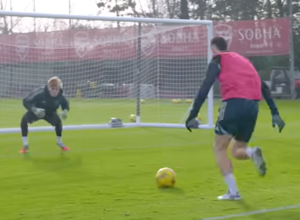

## You must at all times for 90 minutes do the following
1. Scan the pitch to look for space/teammate making a run
2. Check you shoulders before receiving the ball. It is difficult to master the correct timing. Scanning must be done 2 seconds before receiving the football.
3. Run on your toes with core tight and low center of gravity.
4. Give your 101%

## Shooting
1.  Fixate your eyes on the ball before shooting to guide it in the right direction.

| Video | TimeStamp | Note | Image
|:-------------|:--------------|:--------------|:--------:|
| https://youtu.be/wNKgKowfNVM     | 3:52           | Gabriel  quickly receives the ball and takes a slightly heavy outside touch with his left football so that the ball is neither too close nor to far. It creates the separation between him and the defender so that shot cannot be blocked| 
| https://www.youtube.com/watch?v=wNKgKowfNVM     |    2:35        |   Kai quickly looks up before shooting  |  
| https://www.youtube.com/watch?v=wNKgKowfNVM     |    3:20        |   Martinelli quickly looks up before shooting  to access where the goal keeper's position  |  

## Defending
1. While defending do not stand in the middle either cover the inside or outside. Always make the opponent take a touch away from the corner and not the middle.

## Dribbling

### Three skills to definely master 
1. outside elastico
2. stepovers 
3. bodyfeints

## Finishing