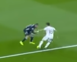

## Body feints is such an effective move and the most used football skill that I have dedicated a readme file for it

|Video|Timestamp|Note|Image|
|:----|:--------|:---|:----|
| https://youtu.be/7YXgidDIi5M   | 3:42  | Martinelli jumps ahead of the ball making the defender think he will continue his run down the line but pushes the forward before passing the ball   |     |
|  https://youtu.be/7YXgidDIi5M   |  4:20      | Martinelli performs a Neymar chop to cut inside. To make it more convincing that he will cut toward the box performs an inside elastico to sell the move and takes another exagerbate step making the defender loose balance     |     |
|  https://www.youtube.com/watch?v=YV7WsYE7tzs   |  2:00      | Arda Güler does a quick body feint to stop the defender for brief moment before pushing the ball wordward     |      | 