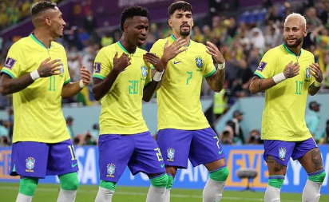

## Movement Training

The inspiration comes from Brazilian footballer who know how to dance both with and without a football.

[more about movement training](https://www.youtube.com/watch?v=lcJ8mCS5BN8)

Running, lifting, pull-ups, squats are great excercise but they are one-dimensional. The human body has far greater freedom when it comes to movement. 

One of the attribute of a great athlete is their ablity to stay relax. 

Atheles whom are indisputed champions when it come to gracefully moving their body around are Bruce Lee and Conor McGregor.

Matter of fact Bruce Lee said

**“Be water, my friend.
Empty your mind, be formless, shapeless—like water.
If you put water into a cup, it becomes the cup.
You put water into a bottle, it becomes the bottle.
You put it in a teapot, it becomes the teapot.
Now water can flow, or it can crash.
Be water, my friend.”**

Dancing does hold the key to unlock movement that mimicks water.

The reason why dance is mentioned here because it can improve coordination, footwork and help build a smooth rythm to dribble a football. 

Note: Dancing is not going to make you a sensi in movement, but it can definitely take you a **one step** closer to it.

|Dance Tutorial|
|:------------|
|https://www.youtube.com/watch?v=iKYA4FZOA00|